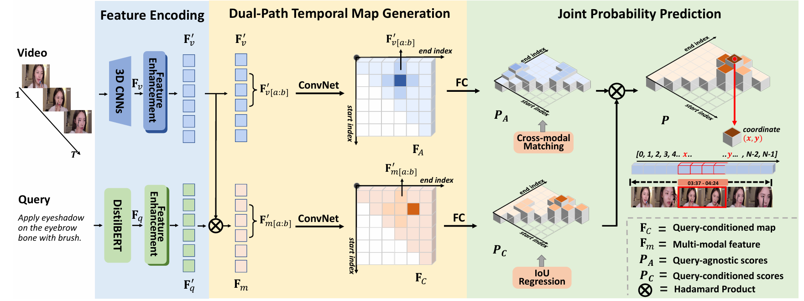
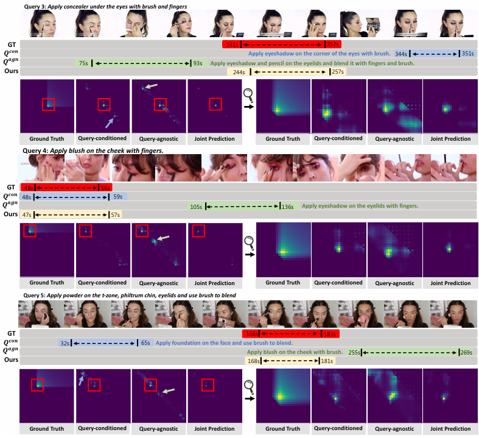

# Dual-Path Temporal Map Optimization for Make-up Temporal Video Grounding


## Abstract

 Make-up temporal video grounding (MTVG) aims to localize the target video segment, which is semantically related to a  sentence describing a make-up activity in a make-up video. Compared with the general video grounding, MTVG focuses on  meticulous actions and changes on the face. The make-up instruction step, usually involving detailed differences in products  and facial areas, is more fine-grained than general activities (e.g., cooking activity and furniture assembly). Thus, existing  general approaches may not effectively locate the target activity effectually due to the lack of fine-grained semantic cues  for the make-up semantic comprehension. To tackle this issue, we propose an effective proposal-based framework named  Dual-Path Temporal Map Optimization Network to capture fine-grained multimodal semantic details of make-up activities.  We extract both query-agnostic and query-guided features to construct two proposal sets and use specific evaluation methods  for the two sets. Different from the commonly used single structure in previous methods, our dual-path structure can mine  more semantic information in make-up videos and distinguish fine-grained actions well. These two candidate sets represent  the cross-modal makeup video-text similarity and multi-modal fusion relationship, complementing each other. Therefore,  the joint prediction of these sets will enhance the accuracy of video timestamp prediction. Comprehensive experiments on  the YouMakeup dataset demonstrate our proposed dual structure excels in fine-grained semantic comprehension.


## Pipeline




## Visualization

Qualitative results of predicted 2D temporal maps. GT denotes the ground truth temporal map, Q_agn and Q_con denote the interference proposal in the query-agnostic and query-conditioned temporal maps, respectively. Ours denotes the prediction results of our proposed method. We can see that our method enjoys better grounding results




## Training and Validation

Training

```bash
./scripts/makeup_train.sh
```

Evaluation

```
./scripts/eval.sh
```


